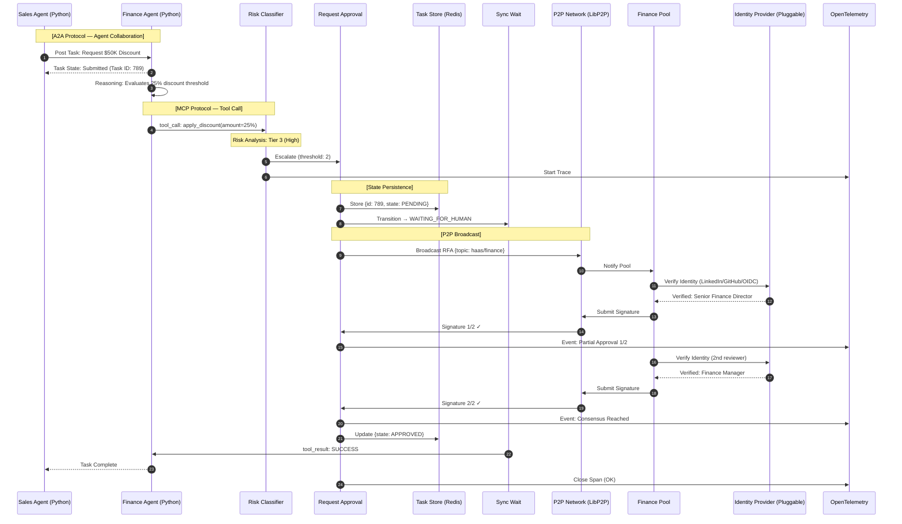
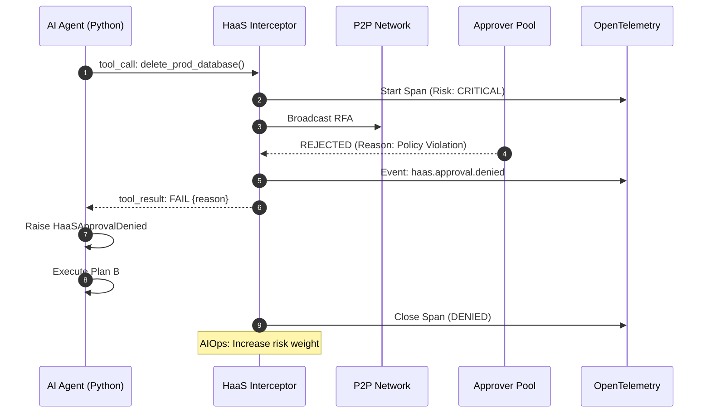
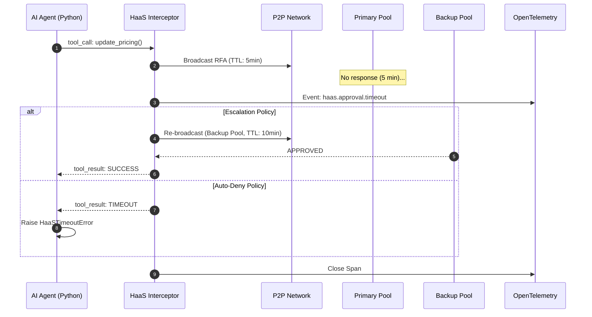
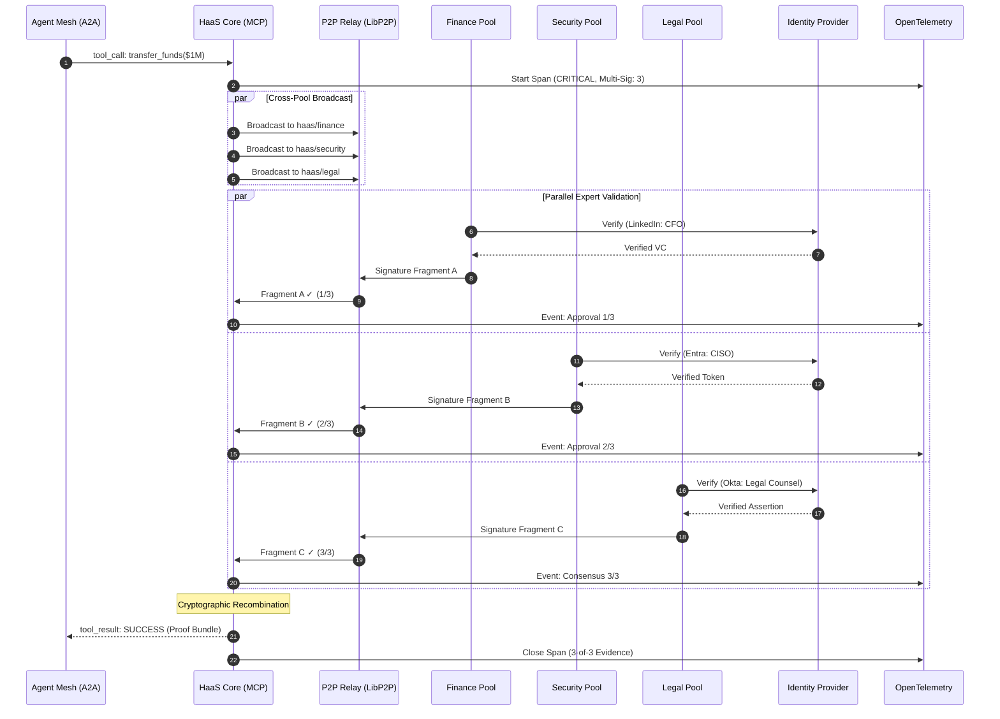
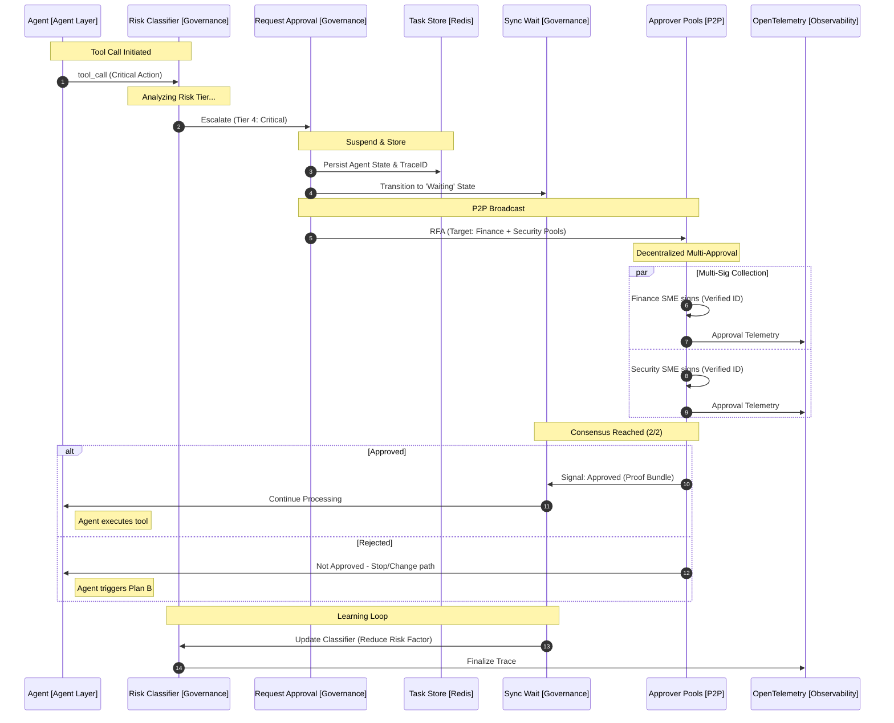

# Sequence Flows

This document contains all sequence diagrams for the AgentGuard HaaS framework, covering standard approval, rejection, timeout, escalation, and cross-pool multi-sig scenarios.

---

## 1. Standard Approval Flow (Tier 3 — High Risk)

---

## 2. Rejection Flow

---

## 3. Timeout & Escalation Flow

---

## 4. Cross-Pool Critical Flow (Tier 4 — Multi-Sig)

---

## 5. Full Enterprise Flow (Aligned with Draw.io Architecture)

This flow maps to the component IDs in the enterprise Draw.io diagram.

---

## 6. Component Interaction Matrix

| Source | Target | Protocol | Data |
|--------|--------|----------|------|
| Python Agent | HaaS Core | MCP / HTTP | ToolCall payload |
| HaaS Core | Risk Classifier | Internal | Tool metadata |
| Risk Classifier | State Machine | Internal | RiskTier + Policy |
| State Machine | Task Store | Redis/Map | PendingTask |
| State Machine | P2P Node | LibP2P | RFA broadcast |
| P2P Node | Approver Pools | GossipSub | Encrypted RFA |
| Reviewer | Identity Provider | OIDC/OAuth | Challenge-Response |
| Reviewer | P2P Node | GossipSub | Signed Approval |
| P2P Node | Consensus Engine | Internal | SignatureEntry |
| Consensus Engine | State Machine | Internal | ConsensusBundle |
| State Machine | Python Agent | MCP / HTTP | ToolCallResult |
| All Components | OTel Collector | gRPC | Traces + Events |
